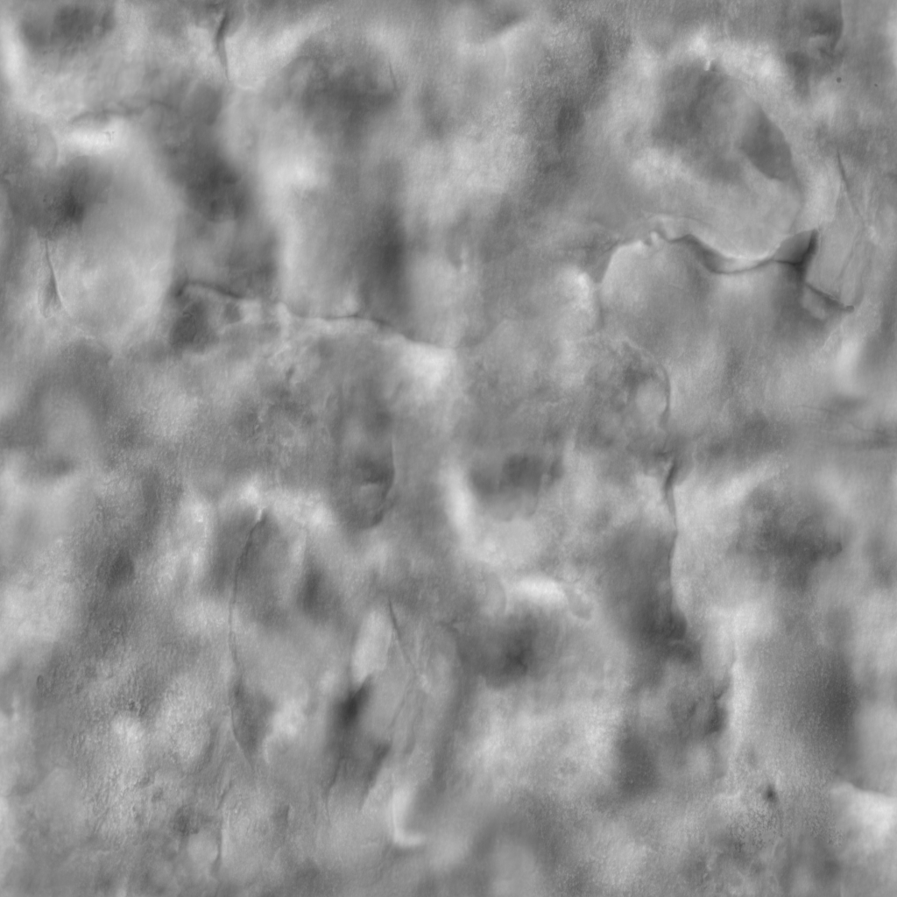
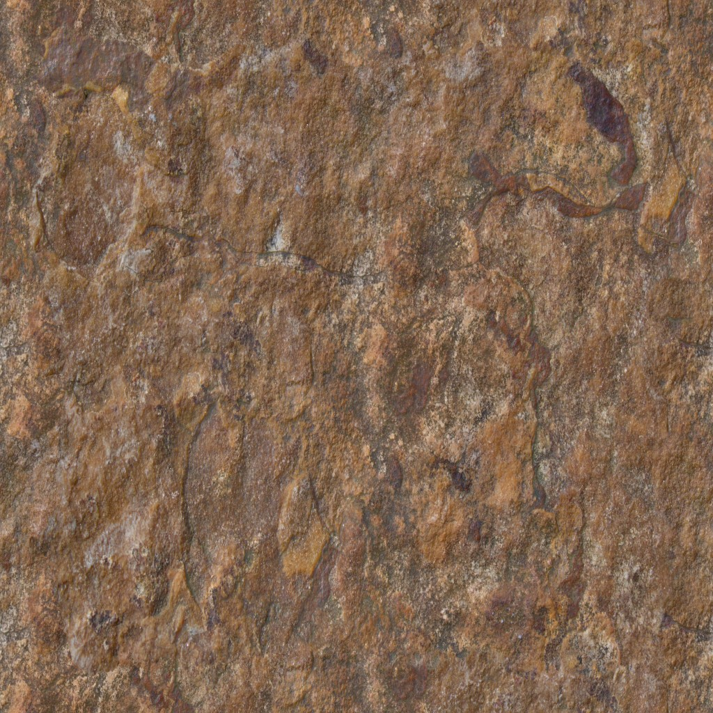
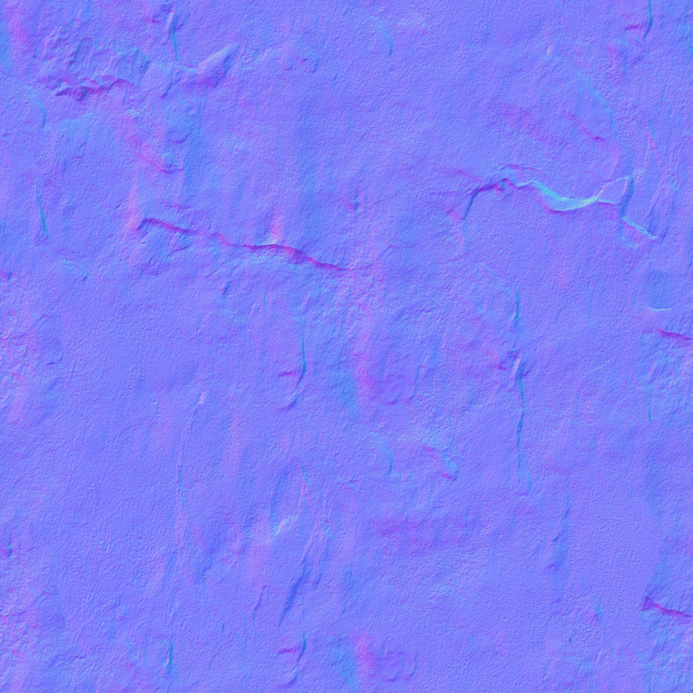
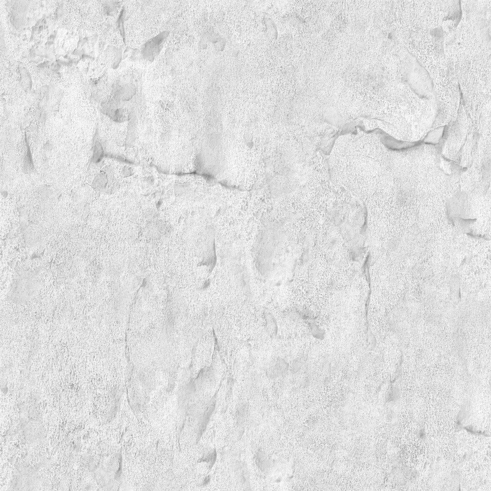
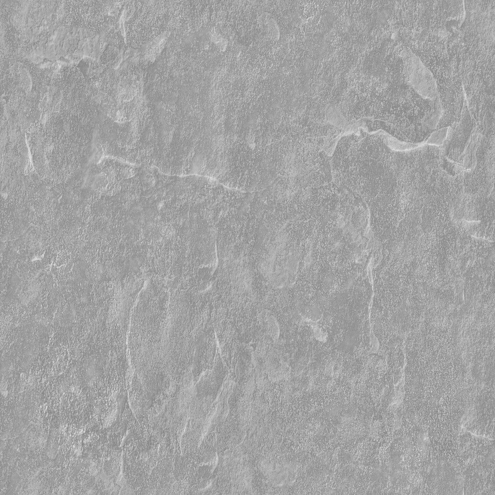

# Maps
There are a lot of maps, and they're all so confusing!  This page will hopefully break down what each map does in an easy to understand way.

## Bump map

A bump map gives fake detail to an object by affecting the way light reflects on it.  It does not modify the geometry of an object.

## Diffuse map

The diffuse map is your standard texture.  I.E., it's literally the main image that gets slapped on the object.

## Emissive map

The emissive map makes the object glow/emit light.  The object will glow the respective colors in the map.  Brighter colors mean brighter light.

Here's an example, but note that the material in our example doesn't glow so it's all black lol

## Normal map

A normal map, like the bump map, helps objects to look more detailed.  Again, it doesn't modify the geometry of an object.

## Ambient Occlusion map

This map affects how much the ambient lighting affects it.  Just go look it up on Wikipedia, bro.

## Specular map

This map affects how shiny/rough an object looks.  The whiter the pixel, the shinier the block is in that location.

